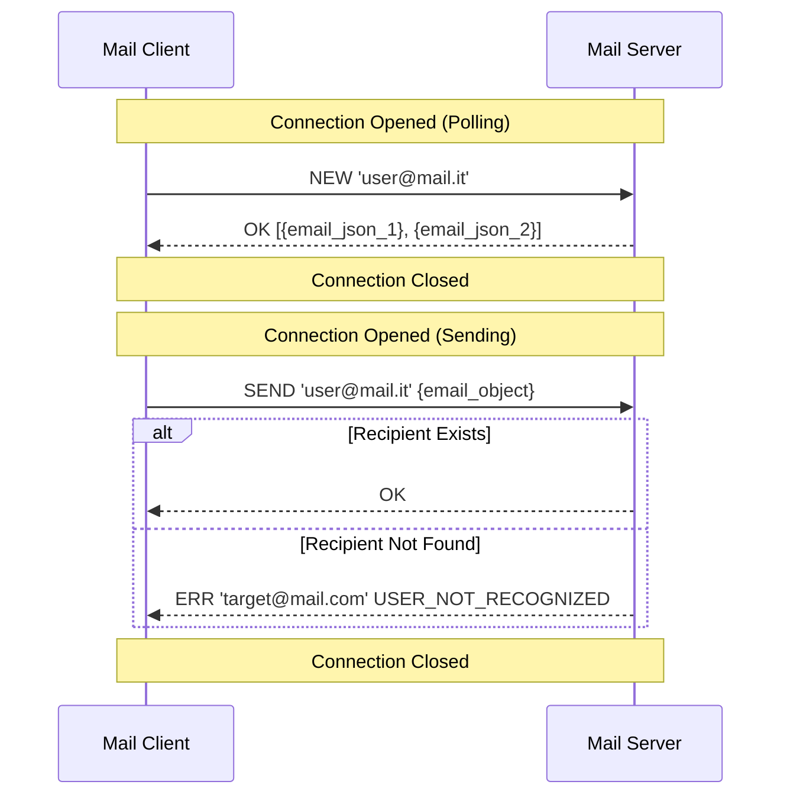

# Java Concurrent Mail System: Stateless MVC Architecture

### Overview
A multithreaded Client-Server ecosystem simulating a complete email service. Developed in **Java 17+**, the project implements a strict **MVC (Model-View-Controller)** pattern. It features a custom, stateless application-level protocol over TCP Sockets, designed to handle concurrent client interactions with high reliability and reactive UI updates.

### Team & Collaboration
This project was developed in a team of 3 students. Following a collaborative "Full-Stack" approach, all members contributed to both the networking logic and the GUI development to ensure a seamless integration of the MVC pattern across the distributed system.

**My specific contributions and hands-on experience:**
* **Networking & Protocol:** Designed and implemented the stateless TCP socket logic and the custom text-based communication protocol.
* **Concurrency Management:** Developed the "Thread-per-Request" server model and handled thread-safe UI updates in JavaFX.
* **Reactive UI:** Implemented the client-side View-Controller logic using JavaFX Properties and ObservableLists for real-time inbox synchronization.
* **Persistence Layer:** Managed file-based data persistence (JSON/Binary) and implemented robust error-handling for server downtime.

**Co-authors:** Giaccherini Davide, Kukaj Briken

---

### Tech Stack & Concepts
* **Language:** Java 17+
* **GUI Framework:** JavaFX (FXML, CSS)
* **Networking:** TCP Sockets (Stateless connection model)
* **Design Patterns:** MVC, Observer-Observable (via JavaFX Properties), Strategy.
* **Concurrency:** Executor Services, Multithreading, `Platform.runLater()` for UI thread safety.
* **Data Handling:** Regex for email validation, File I/O for persistence.

---

### System Architecture

#### 1. Stateless Mail Server (The Backbone)
* **High Concurrency:** The server utilizes a multithreaded architecture where each incoming connection is dispatched to a dedicated worker thread, preventing bottlenecks.
* **Stateless Communication:** Connections are opened per-request (similar to HTTP). This prevents resource exhaustion from idle "ghost" connections.
* **Event Logging:** Features a real-time GUI log that monitors network traffic, handshake status, and routing errors without interfering with client-side privacy.

#### 2. Reactive Mail Client (The Frontend)
* **MVC Integrity:** Zero direct coupling between the UI (FXML) and the Data Model. All updates are reactive, powered by JavaFX Observable collections.
* **Resilience & Auto-Reconnect:** Implements a heartbeat/polling mechanism that detects server status. In case of failure, it notifies the user and resumes synchronization automatically once the server is back online.
* **Smart Sync:** To optimize bandwidth, the client only fetches "deltas" (new messages) instead of re-downloading the entire inbox.

---

### Custom Communication Protocol

The system uses a custom text-based handshake. The sequence below illustrates a standard "New Mail Polling" and "Send" routine:



---

### How to Build and Run

1. **Clone the repository:**
```bash
git clone [https://github.com/francesco-gaia/Mail-Client-Server-Java.git](https://github.com/francesco-gaia/Mial-Client-Server-Java.git)
cd Java-Mail-System
```

2. **Launch the Server:**
* Execute the `server.ServerLauncher` class.
* The server will initialize user data and start listening for TCP connections.

3. **Launch the Client(s):**
* Execute the `client.MainLauncher` class.
* You can run multiple instances of the client to simulate communication between different users (e.g., `mario.rossi@mail.it` to `test@mail.it`).

---

### Project Notes
* **Identity:** Uses email addresses as unique identifiers.
* **Security:** Implements client-side Regex validation to filter malformed requests before they hit the network.
* **Scalability:** Designed to handle increasing mailbox sizes by using targeted data transmission (only new/unread messages).


